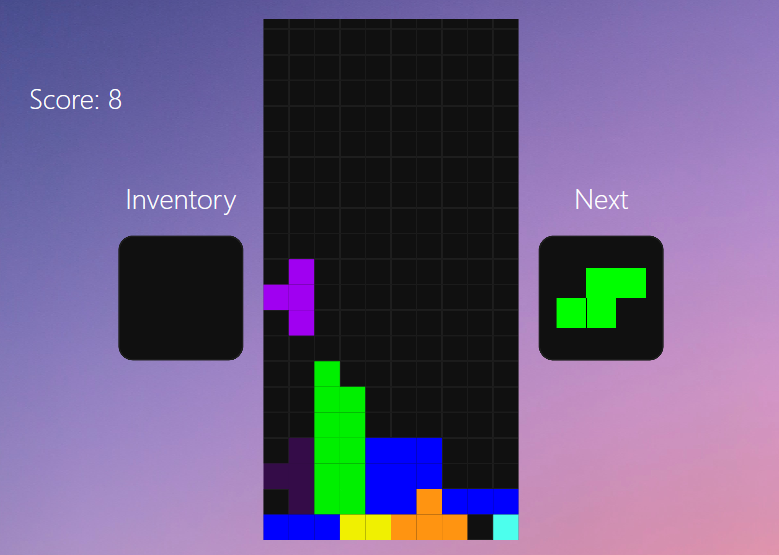
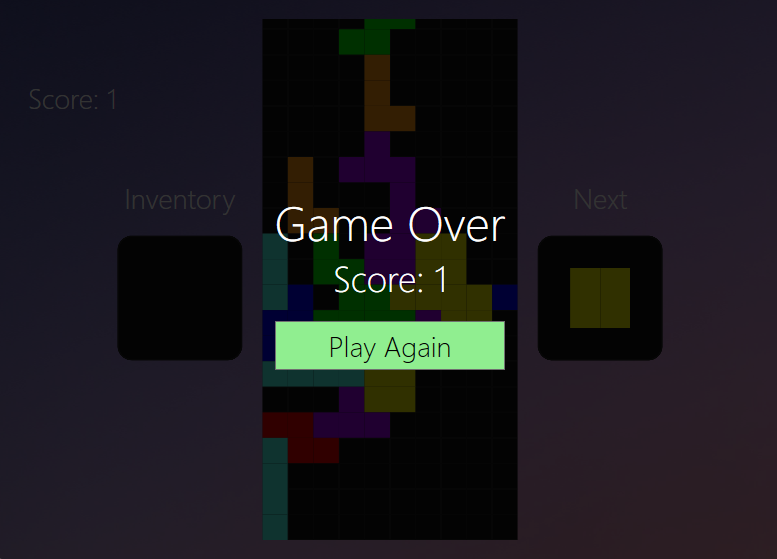

# Tetris Project in C# WPF

## Description

This is a Tetris game implementation in C# using the Windows Presentation Foundation (WPF) framework. 

Tetris is a classic puzzle game where the player manipulates falling blocks to create complete horizontal lines. 
When a line is formed, it disappears, and the player earns points. 
The game ends when the stack of blocks reaches the top of the playfield.

## Features

- Simple and intuitive WPF user interface.
- Randomized block generation for varied gameplay.
- Score tracking and display.
- Speed increases as the player's score increases, creating a challenging experience.
- Game over screen with the option to restart the game.
- Controls:
  - Left arrow key: Move block left.
  - Right arrow key: Move block right.
  - Down arrow key: Accelerate block descent.
  - Up arrow key: Rotate block.
  - Z key: Hold block in inventory
  - Space key: Instant descent block.

## How to Play

Download and execute SNtetris.exe.

## Screenshots

## Requirements

- .NET Framework 4.5 or higher.
- Windows Operating System (for WPF support).

## Dependencies

The project has the following dependencies:

- [WPF](https://docs.microsoft.com/en-us/dotnet/desktop/wpf/?view=netdesktop-5.0)

## Contributing

Contributions to the Tetris project are welcome! If you find any issues or want to add new features, feel free to open an issue or submit a pull request.

## Credits

The implementation of this Tetris game is inspired by various online tutorials and resources :

- [C# Microsoft Documentation]([https://www.youtube.com/watch?v=App_KMRRy7g](https://learn.microsoft.com/en-us/dotnet/csharp/))
- [WPF Microsoft Documentation](https://docs.microsoft.com/en-us/dotnet/desktop/wpf/?view=netdesktop-5.0)

---

Enjoy the game and happy coding!

*Author: acotinier*
